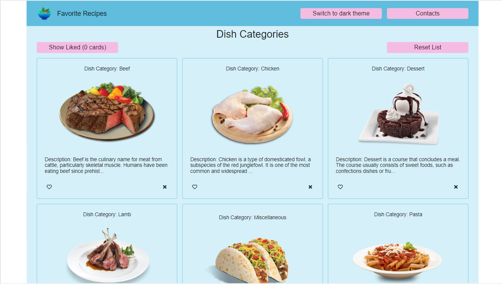
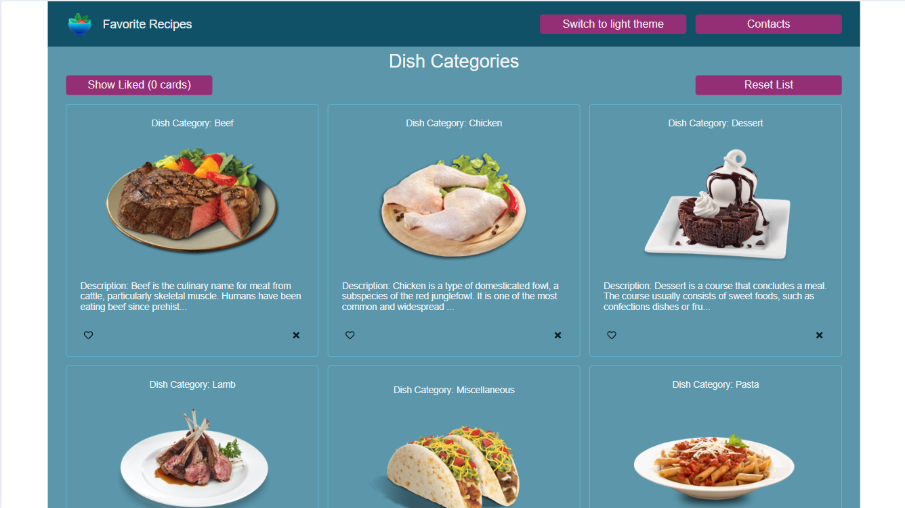

##Recipes Search Application

Application that fetches dish recipes from open Api and renders them in a user attractive form.

App has the following features:

1. You can see the whole list of dish categories
2. You can select categories that you like and display your selection
3. You can delete dish categories
4. You can reset your choice by clicking "Reset List" button. The whole data will be refetched from Api
5. You can toggle from light to dark theme

Stack: React, Redux Tool Kit, Redux Tool Kit Query, Type Script, SCSS

[Deploy](https://ElenaSinelle.github.io/Alfa/)
